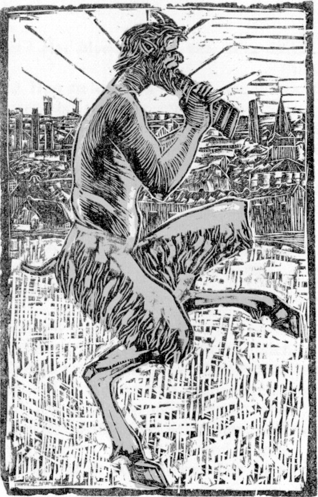

# Pan
Yet another JavaScript runtime powered by Hermes. Pan is built to support [positron](https://github.com/hahnlee/positron)

# Motivation
Just for Fun! ...but, I was inspired by the following reasons:

electron is a great framework, but app's backend code is written in JS so you can check it easily. tauri is also a great framework, but it was a pity that app's backend couldn't be written in JS.

The characteristics of the Hermes engine that can compile bytecode with JS and execute with bytecode stood out. Pan aims to provide an electron-like framework using this to make the backend code more difficult to understand.

I hope one day we can write wasm in JS and link it with the electron/tauri API, and the goal of this runtime will be achieved in a different way.

# Goals
- **Interoperability with Node.js**
- Support .hbc import and export
- Support Node.js API
- Support Node API (N-API)
- Support CommonJS with Node Module Resolution

# Non-Goals
- Node addons without using Node API (N-API)
- Better module system (or better module resolution)
- ESM modules (for now)
- Cross platform (for now)
- Libuv

# Note
- This is a POC framework.
- It only works on macOS.

# LICENSE
- MIT (code)
- CC BY-SA 4.0 (logo image)
  - [Original Image](https://en.wikipedia.org/wiki/Pan_(god)#/media/File:Archive-ugent-be-E898690E-0C16-11E3-8D98-58C697481370_DS-24_(2).jpg)
